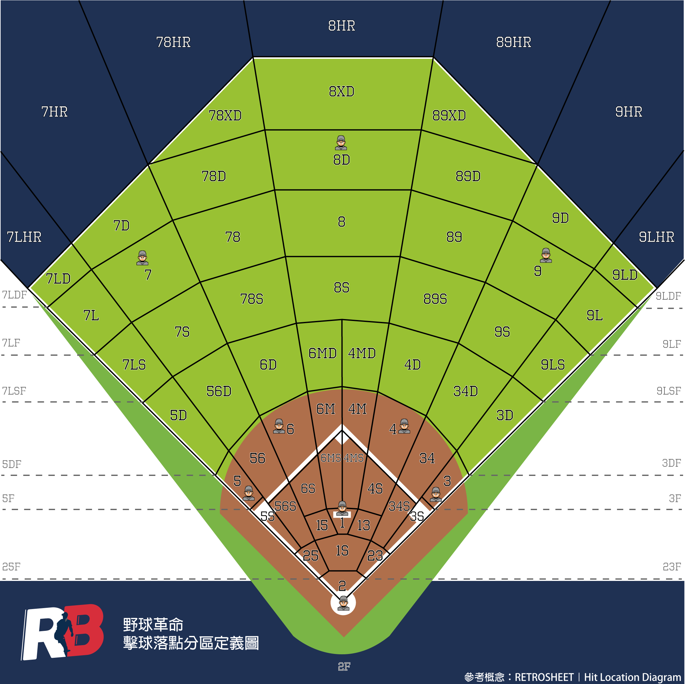

# 打席表格｜PA Table
儲存打席資訊，每個 `game` 會包含 `awayPAList` 與 `homePAList`，各為一個 `PA` 陣列

| 欄位名稱 | 欄位型態 | 欄位說明 | 範例 | 備註 |
| - | - | - | - | - |
| inning | Int | 局數 | 1 |  |
| scored | Boolean | 有得分 | false |  |
| batterName | String | 打者名稱 | 陳晨威 |  |
| batterHand | String | 打者用手 | L | R / L |
| pitcherName | String | 投手名稱 | 德保拉 |  |
| pitcherHand | String | 投手用手 | L | R / L |
| catcherName | String | 捕手名稱 | 福來喜 |  |
| paRound | Int | 進攻輪次 | 1 |  |
| paOrder | Int | 打序 | 1 |  |
| isPH | Boolean | 是代打 | false |  |
| awayScores | Int | 結束打席前客場分 | 0 |  |
| homeScores | Int | 結束打席前主場分 | 0 |  |
| strikes | Int | 結束打席前好球數 | 2 |  |
| balls | Int | 結束打席前壞球數 | 3 |  |
| outs | Int | 結束打席前出局數 | 0 |  |
| bases | [BASES](#bases) | 結束打席前壘包狀況 | 0 |  |
| homeWE | String | 結束打席前主場勝率 | 0.540 | [數據解釋](https://www.rebas.tw/coefficient?coef=we) |
| RE | String | 結束打席前得分期望值 | 0.555 | [數據解釋](https://www.rebas.tw/coefficient?coef=re) |
| pitchCodes | [][PITCH CODE](./event.md#pitch-code) | 投球結果列表 | ["B", "H"] |  |
| events | [][event](./event.md) | 打席內事件 |  |  |
| results | [RESULT](#result) | 打席結果 | uBB |  |
| RBI | Int | 打點 | 0 |  |
| locationCode | [LOCATION CODE](#location-code) | 擊球落點 |  |  |
| trajectory | [TRAJECTORY](#trajectory) | 擊球彈道 |  |  |
| hardness | [HARDNESS](#hardness) | 擊球力道 |  | 非全部擊球結果都有 |
| endAwayScores | Int | 打席結束後客場分 | 0 |  |
| endHomeScores | Int | 打席結束後主場分 | 0 |  |
| endOuts | Int | 打席結束後出局數 | 0 |  |
| endBases | [BASES](#bases) | 打席結束後壘包狀況 | 1 |  |
| WPA | String | 勝率增加 | -0.000 |  |
| RE24 | String | 得分期望值增加 | 0.401 |  |

## BASES
> 一壘有人 +1｜二壘有人 +2｜三壘有人 +4

| 值 | 代表意義 |
| - | - |
| 0 | 無人在壘 |
| 1 | 一壘有人 |
| 2 | 二壘有人 |
| 3 | 一二壘有人 |
| 4 | 三壘有人 |
| 5 | 一三壘有人 |
| 6 | 二三壘有人 |
| 7 | 滿壘 |

## RESULT
| 值 | 代表意義 |
| - | - |
| 1B | 一安 |
| 2B | 二安 |
| 3B | 三安 |
| HR | 全壘打 |
| IHR | 場內全壘打 |
| SO | 三振 |
| uBB | 非故意四壞 |
| IBB | 故意四壞 |
| HBP | 觸身保送 |
| GO | 滾地出局 |
| FO | 飛球出局 |
| FC | 野手選擇 |
| E | 失誤 |
| SH | 犧牲觸擊 |
| SF | 犧牲飛球 |
| GIDP | 滾地雙殺 |
| DP | 雙殺 |
| TP | 三殺 |
| IH | 妨礙打擊 |
| IR | 妨礙跑壘 |
| ID | 妨礙守備 |
| IGNORE | 不算打席（壘包跑者出局導致半局結束等） |

## LOCATION CODE
分區概念從 [Retro Sheet Hit Location Diagram](https://www.retrosheet.org/location.htm) 進行延伸

### 概念說明
1. 名詞：守備位置為 1 - 9
2. 形容詞：S 代表典型守位之前
3. 形容詞：D 代表典型守位之後
4. 副詞：X 代表 extremly，原形容詞的加強
5. 形容詞：L 代表靠近邊線
6. 形容詞：M 代表靠近中線
7. 名詞：F 代表落在界外
8. 名詞：HR 代表落在全壘打處

擊球落點分區，可參考以下 

## TRAJECTORY
| 值 | 代表意義 |
| - | - |
| G | 滾地 |
| L | 平飛 |
| F | 高飛 |
| P | 內野高飛 |

## HARDNESS
| 值 | 代表意義 |
| - | - |
| S | 弱 |
| M | 中 |
| H | 強 |
