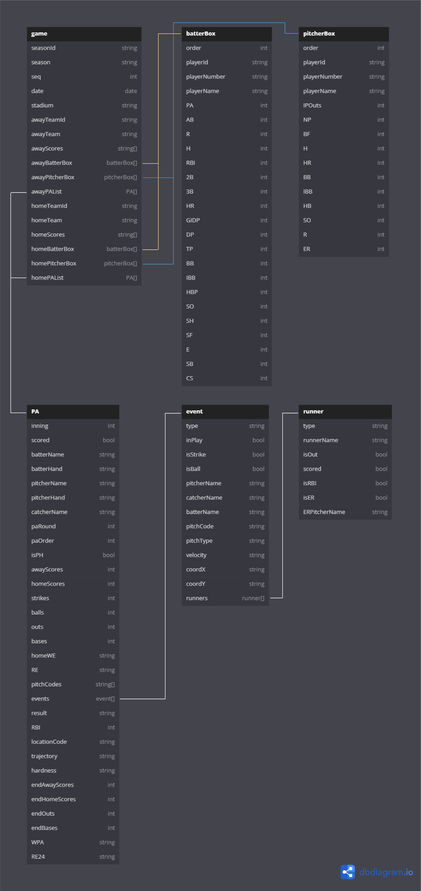

# 資料結構
我們將資料分成 6 張主要的表格，透過 json 格式巢狀儲存
| 表格名稱 | 表格定義 | 關係 |
| - | :-: | :-: |
| [game](./game.md) | 比賽 |  |
| [batterBox](./batterBox.md) | 打者成績 |  |
| [pitcherBox](./pitcherBox.md) | 投手成績 |  |
| [PA](./PA.md) | 打席內容 | 一場比賽有 1 - n 個 PA |
| [event](./event.md) | 事件（投球, 盜壘等） | 一個 PA 有 1 - n 個 event |
| [runner](./runner.md) | 跑者 | 一個 event 有 0 - n 個 runner |

詳細關係表可見下圖

