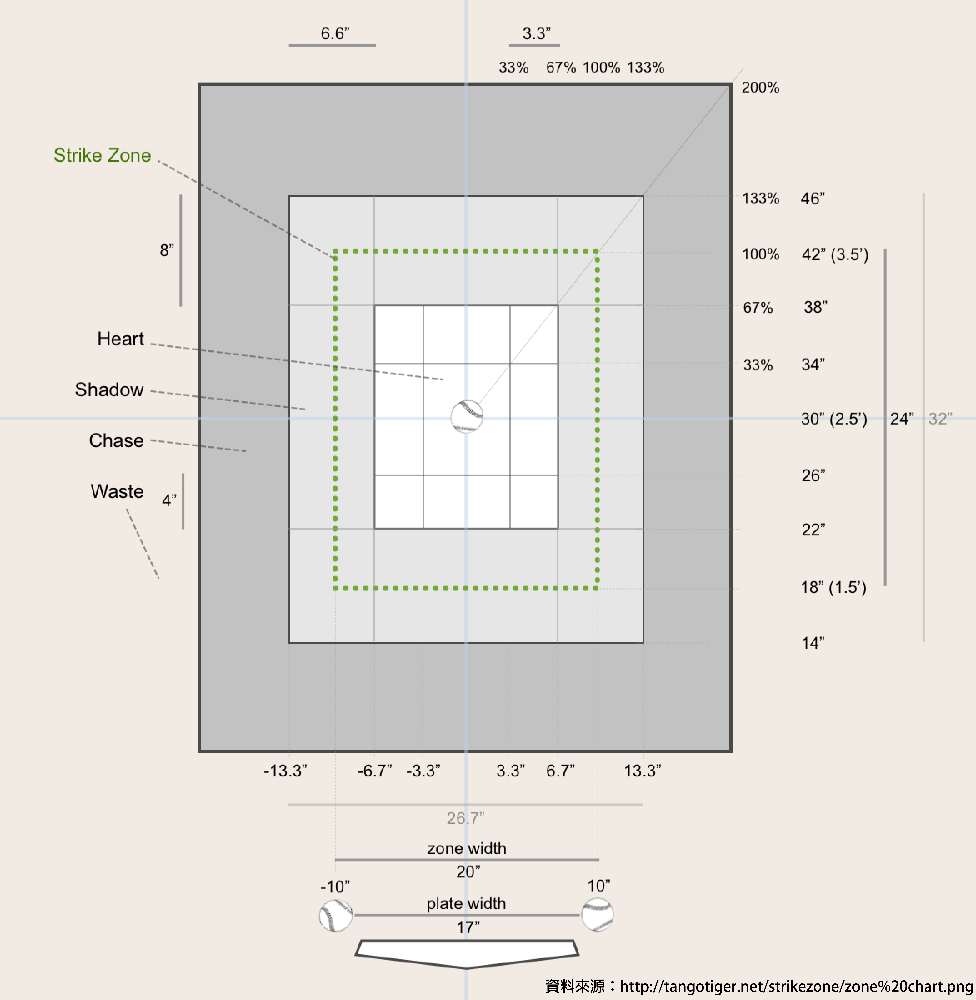

# 事件表格｜Event Table
儲存打席資訊，每個 `PA` 會儲存一個 `events` 欄位，作為儲存 1 至 n 個 `event` 的陣列

| 欄位名稱 | 欄位型態 | 欄位說明 | 範例 | 備註 |
| - | - | - | - | - |
| type | [EVENT TYPE](#event-type) | 事件型態 | PITCH |  |
| inPlay | Boolean | 球進場 | false |  |
| isStrike | Boolean | 是好球 | false | 判斷 `pitchCode` 是否應為好球，無論是否兩好球 |
| isBall | Boolean | 是壞球 | true | 判斷 `pitchCode` 是否應為壞球，無論是否三壞球 |
| pitcherName | String | 投手名稱 | 德保拉 |  |
| catcherName | String | 捕手名稱 | 福來喜 |  |
| batterName | String | 打者名稱 | 陳晨威 |  |
| pitchCode | [PITCH CODE](#pitch-code) | 投球結果 | B |  |
| pitchType | [PITCH TYPE](#pitch-type) | 球種 | FF |  |
| velocity | String | 球速 | 141 | 以字串儲存，非所有球都有 |
| coordX | String | [COORD X](#coord-x) | -28.67 | 以字串儲存，非所有球都有 |
| coordY | String | [COORD Y](#coord-y) | -71.95 | 以字串儲存，非所有球都有 |
| runners | [][runner](./runner.md) | 跑者 |  |  |

## EVENT TYPE
| 值 | 代表意義 |
| - | - |
| PITCH | 投球事件，可能包含跑壘 |
| BASE | 無投球跑壘事件 |
| NO_PITCH | 無投球事件 |
| SUB | 換人事件 |

## PITCH CODE
| 值 | 代表意義 |
| - | - |
| S | 無揮棒好球 |
| SW | 揮棒落空 |
| B | 壞球 |
| F | 界外 |
| FT | 擦棒被捕 |
| FOUL_BUNT | 觸擊界外 |
| TRY_BUNT | 觸擊落空 |
| BUNT | 觸擊 |
| H | 擊球進場 |

## PITCH TYPE
| 值 | 代表意義 |
| - | - |
| FF | 四縫 |
| SI | 伸卡/二縫 |
| FC | 卡特 |
| KN | 蝴蝶 |
| SL | 滑球 |
| CU | 曲球 |
| CH | 變速 |
| FO | 指叉 |
| FS | 快指 |
| EP | 小便 |

## COORD X
進壘點X

以好球帶正中心為 0，投手視角向右為正，單位約為 0.5 公分

本壘板寬度左右各往外半顆球 = 好球帶寬度 = 100%

## COORD Y
進壘點Y

以好球帶正中心為 0，投手視角向上為正，單位約為 0.5 公分

好球帶寬度 * 120% = 好球帶高度

[參考 Tango Tiger](https://tangotiger.net/strikezone/zone%20chart.png)

*進壘點大量仰賴人工透過轉播畫面進行紀錄，請謹慎考量操作誤差
